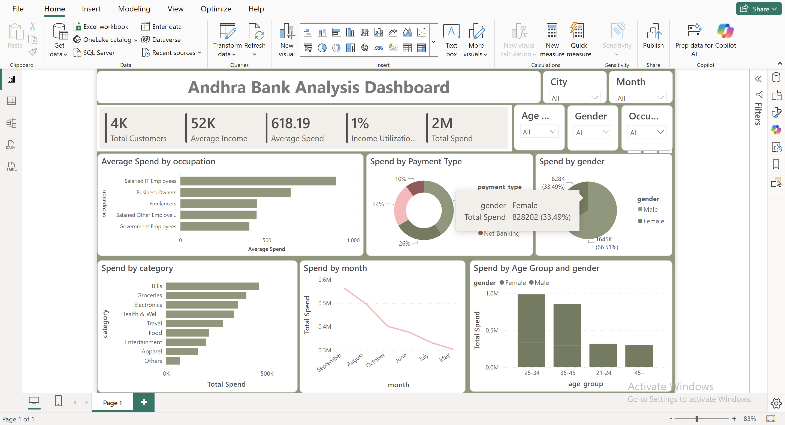

# 🏦 Andhra Bank Analysis Dashboard

<p align="center">


</p>

---

# 🚀 Project Overview

The **Andhra Bank Analysis Dashboard** is an interactive **Power BI** dashboard built to analyze customer demographics, income, spending behavior, payment preferences, and transaction trends.

The dashboard leverages **Power Query**, **Data Modeling**, and **DAX Measures** to transform raw banking data into meaningful business insights. It helps financial institutions understand customer spending habits, identify high-value customer segments, and support data-driven business decisions.

---

# 📸 Dashboard Preview



---

# 🎯 Business Objective

The objective of this dashboard is to help banking stakeholders:

✅ Analyze customer demographics

✅ Monitor customer spending patterns

✅ Identify high-value customer segments

✅ Understand payment preferences

✅ Track monthly spending trends

✅ Support customer-centric marketing strategies

---

# 📌 Dashboard KPIs

| 📊 KPI | Value |
|--------|--------|
| 👥 Total Customers | 4K |
| 💰 Average Income | 52K |
| 💳 Average Spend | 618.19 |
| 📈 Income Utilization | 1% |
| 💵 Total Spend | 2M |

---

# 📈 Dashboard Visualizations

### 💼 Average Spend by Occupation

✔ Compare average customer spending across different occupations.

---

### 💳 Spend by Payment Type

✔ Analyze customer preference for different payment methods.

---

### 👥 Spend by Gender

✔ Compare total spending between male and female customers.

---

### 🛒 Spend by Category

✔ Identify product and service categories with the highest customer expenditure.

---

### 📅 Spend by Month

✔ Track monthly spending trends to identify seasonal customer behavior.

---

### 👤 Spend by Age Group & Gender

✔ Analyze customer spending across different age groups segmented by gender.

---

# 🎛 Interactive Filters

The dashboard includes dynamic slicers for:

🏙️ City

📅 Month

🎂 Age Group

👤 Gender

💼 Occupation

These filters dynamically update all KPIs and visualizations.

---

# ⚙️ Tools Used

| Tool | Purpose |
|------|----------|
| 📊 Power BI Desktop | Dashboard Development |
| 🔄 Power Query | Data Cleaning & Transformation |
| 🧮 DAX | KPI & Measure Creation |
| 📂 Data Modeling | Relationship Management |
| 📈 Interactive Visualizations | Banking Analytics |

---

# 🔄 Project Workflow

```text
Raw Banking Dataset
        │
        ▼
Data Cleaning (Power Query)
        │
        ▼
Data Transformation
        │
        ▼
Data Modeling
        │
        ▼
DAX Measures & KPIs
        │
        ▼
Interactive Dashboard
        │
        ▼
Business Insights
```

---

# 📂 Project Structure

```
Andhra-Bank-Analysis-Dashboard
│
├── Dataset
├── Power Query
├── Data Model
├── DAX Measures
├── Dashboard
└── README.md
```

---

# 📁 Folder Structure

```text
Andhra-Bank-Analysis-Dashboard/
│
├── README.md
├── Andhra Bank Analysis Dashboard.pbix
├── Dataset/
│   └── dim_customers.csv
│   └── dim_customers.csv
├── images/
│   └── dashboard.png
└── .gitignore
```

---

# 💡 Key Business Insights

📌 The bank serves approximately **4,000 customers**.

📌 Customers have an average annual income of **52K**.

📌 Total customer spending exceeds **2 Million**.

📌 Salaried IT employees contribute the highest average spending.

📌 Card payments account for the majority of customer transactions.

📌 Customers aged **25–34** and **35–45** contribute the largest share of total spending.

📌 Grocery and Bills are among the highest spending categories.

📌 Monthly spending trends help identify seasonal variations in customer transactions.

---

# 🛠 Skills Demonstrated

✅ Power BI Dashboard Development

✅ Power Query

✅ Data Cleaning

✅ Data Transformation

✅ Data Modeling

✅ DAX Measures

✅ Banking Analytics

✅ Customer Segmentation

✅ Customer Behavior Analysis

✅ Financial Reporting

✅ KPI Development

✅ Interactive Dashboard Design

---

# 🌟 Business Value

This dashboard enables banking teams to:

📊 Understand customer spending behavior

💳 Analyze payment preferences

👥 Segment customers effectively

📈 Monitor spending trends

🎯 Design targeted marketing campaigns

📌 Make data-driven business decisions

---

# 🔮 Future Enhancements

- 🤖 Customer Churn Prediction
- 💳 Credit Card Usage Analysis
- 📈 Customer Lifetime Value (CLV) Dashboard
- 💰 Loan & Deposit Analytics
- 🎯 Personalized Customer Recommendation Engine
- 📊 Branch Performance Dashboard

---

# 📚 Learning Outcomes

Through this project, I strengthened my skills in:

- ✔ Power BI Dashboard Development
- ✔ Power Query
- ✔ DAX Calculations
- ✔ Data Modeling
- ✔ Banking Analytics
- ✔ Customer Analytics
- ✔ KPI Development
- ✔ Interactive Dashboard Design
